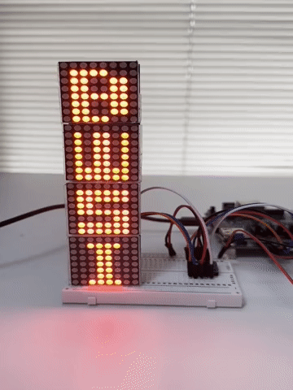
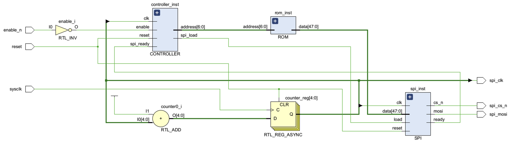

   

# 32x8 LED Matrix Animation

## Introduction

This report details the development of an ASIC-based system for rendering animations on a 32x8 LED matrix, undertaken as part of the 2024 [MIT Beaver Works Summer Institute (BWSI) Program](https://bwsi.mit.edu/). The core of this system is a custom-designed Application-Specific Integrated Circuit (ASIC) which utilizes the Serial Peripheral Interface (SPI) protocol to control the LED display. The Verilog code for the ASIC is available in the project repository.

In addition to the ASIC, the project involved the design and implementation of supporting microelectronics, including four 8x8 LED matrices, MAX7221 LED drivers, and TXS0108E voltage level shifters.

The functionality of the Verilog code was validated using a [Zynq-7000 ARM/FPGA SoC Development Board](https://digilent.com/shop/zybo-z7-zynq-7000-arm-fpga-soc-development-board/). The microelectronics design was prototyped and tested via breadboarding. A demonstration of the system's output is provided in the video linked below. The Verilog design is currently undergoing ASIC hardening through [Tiny Tapeout 9](https://tinytapeout.com/runs/tt09/tt_um_led_matrix_ayla_lin), with an anticipated completion date in summer 2025.

## ASIC Design

[The ASIC](https://gds-viewer.tinytapeout.com/?model=https%3A%2F%2Fshuttle-assets.tinytapeout.com%2Ftt09%2Ftt_um_led_matrix_ayla_lin%2Ftt_um_led_matrix_ayla_lin.gds.gltf) comprises four key components, all implemented in Verilog:
- **ROM**: Stores the following:
  - SPI commands for initializing the MAX7221 drivers.
  - Two 32x8 1-bit masks representing animation frames, along with their corresponding column offsets for the LED matrix.
- **SPI**: Implements the Master Out Slave In (MOSI) mode, which is required for driving the MAX7221. The SPI module operates in three states:
  - IDLE: Awaiting instructions from the CONTROLLER.
  - SEND: Transmitting commands and data to the MAX7221 drivers.
  - PAUSE: Ceasing transmission to the MAX7221, which continues to display the last received bitmask.
- **CONTROLLER**: Directs the SPI module to initialize the MAX7221 drivers and periodically retrieves bitmaps from the ROM to send to the drivers. The controller has four states:
  - IDLE: Waiting for the SPI module to become ready.
  - SETUP: Initializing the MAX7221 drivers. This involves setting the ROM address to the initialization commands and instructing the SPI module to transmit these commands.
  - DISPLAY: Sending a 32x8 pixel bitmap to the MAX7221 drivers, achieved by setting the ROM address to the corresponding bitmask and instructing the SPI module.
  - PAUSE: Pausing the SPI module for 2^21 clock cycles (approximately 1 second) to maintain the display of the current bitmask for that duration.
- **Clock Downsampler (RTL_ADD and RTL_REG_ASYNC)**: To reconcile the 33 MHz clock frequency of the Tiny Tapeout ASIC and Zynq-7000 FPGA development boards with the 10 MHz maximum supported frequency of the MAX7221 drivers, a four-bit counter is used to reduce the clock frequency to 33/16 MHz.

## Microelectronics Design

LED Matrices and Drivers: The animation display comprises four 8x8 LED matrices, each driven by a MAX7221 driver. The drivers are cascaded, connecting their LOAD and CLK signals in parallel, while the DIN of each subsequent driver is connected to the DOUT of the preceding one. This cascading arrangement enables control of multiple MAX7221 drivers, and thus multiple LED matrices, using only three output ports from the ASIC. Although the current implementation utilizes four LED matrices, the design is scalable to support additional matrices without increasing the number of ASIC output ports.

Voltage Level Converter: The Tiny Tapeout ASIC and Zynq-7000 FPGA output 3.3V, while the MAX7221 drivers require an input voltage between 4.0V and 5.5V. A TXS0108E Level Shifter is employed to convert the ASIC/FPGA output from 3.3V to 5.0V. The TXS0108E provides eight channels, but only three (CLK, LOAD, and DIN) are utilized in this implementation.

## Design Process

This project was undertaken to apply and expand upon knowledge of ASIC design and microelectronics acquired during the BWSI program and to develop a functional and engaging system. The initial concept involved direct control of the LED matrices by the ASIC, outputting pixel row/column coordinates. This approach, while simpler in terms of avoiding the SPI protocol and MAX7221 drivers, would have necessitated a significantly larger number of output ports. For instance, an 8x8 bitmap would require 16 ports, and larger bitmaps would require more.

To enable more complex and visually interesting animations, the SPI protocol was adopted. The current 32x8 pixel implementation was selected as a compromise between visual detail and cost constraints associated with the Tiny Tapeout process, which scales with chip area. The design is readily adaptable to accommodate larger animations with minor modifications.

